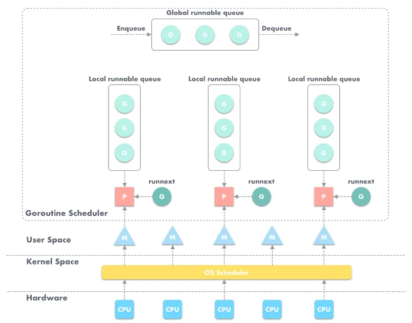

# G-P-M

> [GMP 并发调度器深度解析之手撸一个高性能 goroutine pool](https://taohuawu.club/archives/high-performance-implementation-of-goroutine-pool)
>
> [github 地址](https://github.com/panjf2000/ants)

> Go的GMP模型真的“简单”
>
> [https://mp.weixin.qq.com/s/9rBFZGlu8Kt5W8VgdoQkow](https://mp.weixin.qq.com/s/9rBFZGlu8Kt5W8VgdoQkow)

## G-P-M 模型概述 <a href="#racnn" id="racnn"></a>

在 Go 中，每一个 goroutine 是一个独立的执行单元，相较于每个 OS 线程固定分配 2M 内存的模式，goroutine 的栈采取了动态扩容方式，初始时仅为 2KB，随着任务执行按需增长，最大可达 1GB（64 位机器最大是 1 GB，32 位机器最大是 256 M），且完全由 golang 自己的调度器 Go Scheduler 来调度

任何用户线程最终肯定都是要交由 OS 线程（操作系统线程）来执行，_`goroutine`_（称为 `G`）也不例外，但是 `G` 并不直接绑定 OS 线程运行，而是由 Goroutine Scheduler 中的 _`P - Logical Processor`_（逻辑处理器）来作为两者的 中介，`P` 可以看作是一个抽象的资源或者一个上下文，一个 `P` 绑定一个 OS 线程，在 golang 的实现里把 OS 线程抽象成一个数据结构：`M`。

G 实际上是由 M 通过 P 来进行调度运行的，但是在 G 的层面来看，P 提供了 G 运行所需的一切资源和环境，因此在 G 看来 P 就是运行它的“CPU“，由 G、P、M 这三种由 Go 抽象出来的实现，最终形成了 Go 调度器的基本结构：

* G：表示 Goroutine，每个 Goroutine 对应一个 G 结构体，G 存储 Goroutine 的运行堆栈、状态以及任务函数，可重用。G 并非执行体，每个 G 需要绑定到 P 才能被调度执行
* P：Processor，表示逻辑处理器，对 G 来说，P 相当于 CPU 核，G 只有绑定到 P（在 P 的 local runq 中）才能被调度。对 M 来说，P 提供了相关的执行环境（context），如分配内存状态（mcache），任务队列（G）等，P 的数量决定了系统内最大可并行的 G 的数量（前提：物理 CPU 核数 >= P 的数量），P 的数量由用户设置的 GOMAXPROCS 决定，但是不论 GOMAXPROCS 设置为多大，P 的数量最大为 256
* M：Machine，OS 线程抽象，代表着真正执行计算的资源，在绑定有效的 P 后，进入 schedule 循环；而 schedule 循环的机制大致上是从 Global 队列、P 的 Local 队列以及 wait 队列中获取 G，切换到 G 的执行栈上并执行 G 的函数，调用 goexit 做清理工作并回到 M，如此反复。M 并不保存 G 状态，这是 G 可以跨 M 调度的基础，M 的数量是不定的，有 Go Runtime 调整，为了防止创建过多 OS 线程导致系统调度不过来，目前默认最大限制为 10000 个

_`work-stealing`_ 调度算法：

* 每一个 P 维护一个 G 的本地队列；
* 当一个 G 被创建出来，或者变为可执行状态，就把他放到 P 的可执行队列中；
* 当一个 G 在一个 M 里执行结束后，P 会从队列中把该 G 取出；如果此时 P 的队列为空，即没有其他 G 可以执行，M 就随机选择另一个 P，从其可执行的 G 队列中取走一半

<figure><figcaption></figcaption></figure>

## G-P-M 模型调度 <a href="#jggxl" id="jggxl"></a>

Go 调度器工作时会维护两种用来保存 G 的任务队列：一种是一个 Global 任务队列，一种是每个 P 维护的 Local 任务队列

当通过 go 关键字创建一个新的 goroutine 的时候，它会优先被放入 P 的本地队列。为了运行 goroutine，M 需要持有（绑定）一个 P，接着 M 会启动一个 OS 线程，循环从 P 的本地队列里取出一个 goroutine 并执行。当然还有上文提及的 work-stealing 调度算法。

### 用户态阻塞/唤醒 <a href="#p7jrg" id="p7jrg"></a>

当 goroutine 因为 channel 操作或者 network I/O 而阻塞时（实际上 golang 已经用 netpoller 实现了 goroutine 网络 I/O 阻塞不会导致 M 被阻塞，仅阻塞 G，这里紧紧是举个例子），

* 对应的 G 会被放置到某个 wait 队列（如 channel 的 waitq），
* 该 G 的状态由 `_Gruning` 变为 `_Gwaitting`，而 M 会跳过该 G 尝试获取并执行下一个 G，如果此时没有 runnable 的 G 供 M 运行，那么 M 将解绑 P，并进入 sleep 状态；
* 当阻塞的 G 被另一端的 G2 唤醒时（比如 channel 的可读/写通知），G 被标记为 runnable，尝试加入 G2 所在 P 的 runnext，然后再是 P 的 Local 队列和 Global 队列

### 系统调用阻塞 <a href="#tytou" id="tytou"></a>

当 G 被阻塞在某个系统调用上时，

* 此时 G 会阻塞在 `_Gsyscall` 状态，M 也处于 block on syscall 状态，此时的 M 可被抢占调度：
  * 执行该 G 的 M 会与 P 解绑，而 P 则尝试与其它空闲 的 M 绑定，继续执行其它 G
  * 如果没有其它空闲的 M，但 P 的 Local 队列中仍然有 G 需要执行，则创建一个新的 M

当系统调用完成后，

* G 会重新尝试获取一个空闲的 P 进入它的 Local 队列恢复执行，
* 如果没有空闲的 P，G 会标记为 runnable 加入到 Global 队列

## 实现一个 Goroutine Pool <a href="#egmrt" id="egmrt"></a>

### 设计思路 <a href="#bh6bp" id="bh6bp"></a>

启动服务之时初始化一个 Goroutine Pool 池，这个 Pool 维护了一个类似栈的 LIFO 队列，里面存放负责处理任务的 Worker，然后在 client 端提交 task 到 Pool 中之后，在 Pool 内部，接收 task 之后的核心操作是：

1. 检查当前 Worker 队列中是否有可用的 Worker，如果有，取出，执行当前的 task；
2. 没有可用的 Worker，判断当前在运行的 Worker 是否已超过该 Pool 的容量：{ 是 -> 再判断工作池是否为非阻塞模式：\[ 是 ——> 直接返回 nil，否 ——> 阻塞等待直至有 Worker 被放回 Pool ]，否 -> 新开一个 Worker（goroutine）处理 }；
3. 每个 Worker 执行完任务之后，放回 Pool 的队列中等待

<figure><figcaption></figcaption></figure>

### 实现细节 <a href="#evrrx" id="evrrx"></a>

#### **首先是 Pool struct**

```go
type sig struct{}

type f func() error

type Pool struct {
    // capacity of the pool
    capacity int32

    // running is the number of the currently running goroutines
    running int32

    // expiryDuration set the expired time (second) of every worker
    expiryDuration time.Duration

    // workers is a slice that store the available workers
    workers []*Worker

    // release is used to notice the pool to closed itself
    release chan sig

    // lock for synchronous operation
    lock sync.Mutex

    once sync.Once
}
```

`Pool`是一个通用的协程池，支持不同类型的任务，亦即每一个任务绑定一个函数提交到池中，批量执行不同类型任务，是一种广义的协程池；

* `capacity` 是该 Pool 的容量，也就是开启 worker 数量的上限，每一个 worker 绑定一个 goroutine；
* `running` 是当前正在执行任务的 worker 数量；
* `expiryDuration` 是 worker 的过期时长，在空闲队列中的 worker 的最新一次运行时间与当前时间之差如果大于这个值则表示已过期，定时清理任务会清理掉这个 worker；
* `workers` 是一个 slice，用来存放空闲 worker，请求进入 Pool 之后会首先检查 workers 中是否有空闲 worker，若有则取出绑定任务执行，否则判断当前运行的 worker 是否已经达到容量上限，是—阻塞等待，否—新开一个 worker 执行任务；
* `release` 是当关闭该 Pool 支持通知所有 worker 退出运行以防 goroutine 泄露；
* `lock` 是一个锁，用以支持 Pool 的同步操作；
* `once` 用在确保 Pool 关闭操作只会执行一次。

#### **初始化 Pool 并启动定期过期 worker 任务**

```go
// NewPool 创建一个实例
func NewPool(size int) (*Pool, error) {
	return NewTimingPool(size, DefaultCleanIntervalTime)
}

// NewTimingPool 创建一个带有自定义定时任务的实例
func NewTimingPool(size, expiry int) (*Pool, error) {
	if size <= 0 {
		return nil, ErrInvalidPoolSize
	}
	if expiry <= 0 {
		return nil, ErrInvalidPoolExpiry
	}
	p := &Pool{
		capacity:       int32(size),
		release:        make(chan sig, 1),
		expiryDuration: time.Duration(expiry) * time.Second,
	}

	// 启动定期清理过期 worker 任务，独立 goroutine 运行，节省系统资源
	p.monitorAndClear()
	return p, nil
}
```

#### **提交任务到 Pool**

```go
// Submit 提交任务到 pool
func (p *Pool) Submit(task f) error {
	// 判断当前 pool 是否已被关闭
	if len(p.release) > 0 {
		return ErrPoolClosed
	}

	// 获取 pool 一个可用的 worker，绑定 task 执行
	w := p.getWorker()
	w.task <- task
	return nil
}
```

第一个 if 判断当前 Pool 是否已被关闭，若是则不再接受新任务，否则获取一个 Pool 中可用的 worker，绑定该 task 执行。

#### **获取可用 worker（核心）**

```go
// getWorker 返回一个可用的 worker 来执行 task
func (p *Pool) getWorker() *Worker {
	var w *Worker
	// 标志变量，判断当前正在运行的 worker 数量是否已到达 pool 的容量上限
	waiting := false

	// 加锁，检测队列中是否有可用的 worker，并进行相应操作
	p.lock.Lock()
	idleWorkers := p.workers
	n := len(idleWorkers) - 1
	// 当前队列中无可用 worker
	if n < 0 {
		// 判断运行 worker 数目已达到该 Pool 的容量上限，置等待标志
		waiting = p.Running() >= p.Cap()
	} else {
		// 当前队列有可用 worker，从队列尾部取出一个使用
		w = idleWorkers[n]
		idleWorkers[n] = nil
		p.workers = idleWorkers[:n]
	}
	// 检测完成，解锁
	p.lock.Unlock()

	// Pool 容量已满，新请求等待
	if waiting {
		// 利用锁阻塞等待直到有空闲 worker
		for {
			p.lock.Lock()
			idleWorkers = p.workers
			l := len(idleWorkers) - 1
			if l < 0 {
				p.lock.Unlock()
				continue
			}
			w = idleWorkers[l]
			idleWorkers[l] = nil
			p.workers = idleWorkers[:l]
			p.lock.Unlock()
			break
		}
	} else if w == nil {
		// 当前无空闲 worker 但是 Pool 还没有满，则可以直接断开一个 worker 执行任务
		w = &Worker{
			pool: p,
			task: make(chan f, 1),
		}
		w.run()
		// 运行 worker 数加一
		p.incRunning()
	}
	return w
}
```

在上面的代码中，

```go
w = idleWorkers[n]
idleWorkers[n] = nil // 可以省略
p.workers = idleWorkers[:n]
```

第二行 idleWorkers\[n] = nil 可以省略，必要性如下：

* 性能：从性能角度来看，设置切片元素为 nil 可能会有轻微的开销，因为它需要写入内存，然而这个开销通常很小，可以忽略不计
  * 垃圾回收（GC）
    * 如果将切片元素设置为 nil 后，原本被引用的对象没有其他引用，那么垃圾回收器可以回收这些对象的内存
    * 如果不将元素设置为 nil，这些对象可能会保留在内存中更长时间，直到 idleWorkers 切片被完全清空或丢弃
  * 内存使用
    * 将元素设置为 nil 可以帮助减少内存泄漏，特别是在长时间运行的程序中
* 安全性：从代码安全性和可维护性角度来看，显示地将元素设置为 nil 有以下好处：
  * 避免悬挂引用
    * 通过将元素设置为 nil，可以确保这些元素不再被意外使用，从而减少潜在的悬挂引用问题
  * 代码意图明确
    * 将元素设置为 nil 可以使代码亿图更加明确，表明这些元素已经被处理过，不再使用

获取可用 worker 绑定任务执行这个协程池的核心操作，主要就是实现一个 LIFO 队列用来存取可用 worker 达到资源复用的效果，之所以采用 LIFO 后进先出队列是因为后进先出可以保证空闲 worker 队列 是按照每个 worker 的最后运行时间从远到近的顺序排列，方便在后续定期清理过期 worker 时排序以及清理完之后重新分配空闲 worker 队列

* LIFO 队列的意义
  * 新加入队列的 worker 会在队列的顶部，在获取时是优先获取到的
* 资源复用
  * 优先使用最近的 worker：最近使用过的可能仍然在缓存中，恢复运行的成本较低
  * 减少内存占用：当一个 worker 完成任务并进入空闲队列时，会被放在队列顶部，在下一个任务到来时可以优先使用它，减少了内存和其他资源的浪费
* 定期清理过期 worker
  * 按最近使用时间排序：最久未使用的 worker 位于队列底部，清理时，只需从队列底部开始清理即可
  * 高效重组队列：清理完过期 worker 后，剩下的 worker 仍然是按最近使用的时间顺序排列的，不需要额外的排序操作

#### **任务执行**

```go
// run 启动一个 goroutine 来重复执行函数调用的过程
func (w *Worker) run() {
	go func() {
		// 循环监听任务队列，一旦有任务立马取出运行
		for fc := range w.task {
			if fc == nil {
				// 退出 goroutine，运行 worker 数减一
				w.pool.decRunning()
				return
			}
			fc()
			// worker 回收复用
			w.pool.putWorker(w)
		}
	}()
}
```

* `p.Submit(task f)` 提交任务到 Pool 之后
* `p.getWorker()` 获取一个可用的 worker，每新建一个 worker 实例之时都需要调用 `w.run()` 启动一个 goroutine 监听 worker 的任务列表 task，一有任务提交就执行
* 调用 `w.sendTask(task f)` 方法提交任务到 worker 的任务队列
* 任务执行完之后，会调用 `w.pool.putWorker(w *Worker)` 将这个已经执行完任务的 worker 从当前任务解绑放回 Pool 中

以上，一个任务从提交到完成的过程结束，Pool 调度将进入下一个循环

#### **Worker 回收（goroutine 复用）**

```go
// putWorker 将 worker 放回空闲 Pool 中，goroutine 复用
func (p *Pool) putWorker(worker *Worker) {
	// 写入回收时间，亦即该 worker 的最后一次结束运行的时间
	worker.recycleTime = time.Now()
	p.lock.Lock()
	p.workers = append(p.workers, worker)
	p.lock.Unlock()
}
```

#### **动态扩容或缩小池容量**

```go
// ReSize 动态扩容或缩小池容量
func (p *Pool) ReSize(size int) {
	if size == p.Cap() {
		return
	}
	atomic.StoreInt32(&p.capacity, int32(size))
	diff := p.Running() - size
	if diff > 0 {
		for i := 0; i < diff; i++ {
			p.getWorker().task <- nil
		}
	}
}
```

* 计算当前运行的 `Worker` 数量与新容量之间的差值，如果差值大于 0，则表示需要关闭一些 `Worker`
* 如果需要关闭 `Worker`，则循环调用 `getWorker` 方法获取一个 `Worker` 并向其 `task` 通道发送 `nil`，表示该 `Worker` 应该停止工作

#### **定期清理过期 Worker**

```go
// periodicallyPurge 定期清理过期 Worker
func (p *Pool) periodicallyPurge() {
	heartbeat := time.NewTicker(p.expiryDuration)
	for range heartbeat.C {
		currentTime := time.Now()
		p.lock.Lock()
		idleWorkers := p.workers
		if len(idleWorkers) == 0 && p.Running() == 0 && len(p.release) > 0 {
			p.lock.Unlock()
			return
		}
		n := 0
		for i, worker := range idleWorkers {
			if currentTime.Sub(worker.recycleTime) <= p.expiryDuration {
				break
			}
			n = i
			worker.task <- nil
			idleWorkers[i] = nil
		}
		n++
		if n >= len(idleWorkers) {
			p.workers = idleWorkers[:0]
		} else {
			p.workers = idleWorkers[n:]
		}
		p.lock.Unlock()
	}
}
```

1. **创建一个定时器**

`heartbeat` 是一个定时器，每隔 `p.expiryDuration` 时间间隔触发一次

2. **定期检查并清理过期的工作线程**

首先判断，说明当前 Pool 已经关闭

```go
if len(idleWorkers) == 0 && p.Running() == 0 && len(p.release) > 0 {
    p.lock.Unlock()
    return
}
```

然后依次查询每个空闲 worker 是否过期，

`worker.recycleTime` 表示当前 worker 最近一次的回收时间

`currentTime.Sub(worker.recycleTime)` 返回 `currentTime - worker.recycleTime` 的时间间隔

`currentTime.Sub(worker.recycleTime) <= p.expiryDuration` 说明还未过期

如果找到了，记录当前的 worker 下标，并向该 worker 发送 nil 以停止工作，

```
for i, w := range idleWorkers {
    if currentTime.Sub(w.recycleTime) <= p.expiryDuration {
        break
    }
    n = i
    w.task <- nil
    idleWorkers[i] = nil
}
```

3. **更新空闲队列**

`n = len(idleWorkers)` 说明，当前队列中的全部 worker 都过期，因此置空；

`n < len(idleWorkers)` 说明，\[0, n-1] 的 worker 都已经过期，清空

```go
n++
if n >= len(idleWorkers) {
    p.workers = idleWorkers[:0]
} else {
    p.workers = idleWorkers[n:]
}
```
